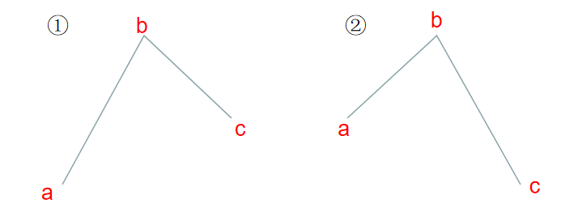

# LeetCode665：非递减数列

## 题目

给你一个长度为 `n` 的整数数组，请你判断在 **最多** 改变 `1` 个元素的情况下，该数组能否变成一个非递减数列。

我们是这样定义一个非递减数列的： 对于数组中所有的 `i` `(0 <= i <= n-2)`，总满足 `nums[i] <= nums[i + 1]`。

 

**示例 1:**

```
输入: nums = [4,2,3]
输出: true
解释: 你可以通过把第一个4变成1来使得它成为一个非递减数列。
```

**示例 2:**

```
输入: nums = [4,2,1]
输出: false
解释: 你不能在只改变一个元素的情况下将其变为非递减数列。
```

 

**说明：**

- `1 <= n <= 10 ^ 4`
- `- 10 ^ 5 <= nums[i] <= 10 ^ 5`

## 解法一：暴力搜索

最简单(蠢)的一个办法，直接遍历所有可能性。代码如下：

```c++
class Solution {
public:
    bool checkPossibility(vector<int>& nums) {
        int n = nums.size();
        if(n<2) return true;	// 空数组 or 1-数组直接返回true
        
        for(int i=0; i<n; i++){		// 遍历所有可能性
           
            int pre = i==0?nums[1]:nums[0];
            bool flag = true;
            
            for(int j=1; j<n; j++){
                if(j==i) continue;
                if(pre>nums[j]){
                    flag=false;
                    break;
                }
                pre=nums[j];
            }
            if(flag)    return true;
        }

        return false;
    }
};
```

时间复杂度：O(n<sup>2</sup>)

空间复杂度：O(1)

## 解法二：一次遍历

非递减数列就是在将数列画成折线图后，不出现`下降点`。如下图所示，如果出现下降点，我们会遇到两种情况：①a点小于/等于c点；② a点大于c点。

对于情况②，想要一次操作消除下降点，只能将c点上移(至b点)；但对于情况①，有两种选择，既可以将c点上移，也可以将b点下移。此时最优的做法是将b点下移，**因为c点上移可能导致后续数列中出现新的下降点**。



还需要考虑一种特殊情况，b为`nums[0]`出现了下降点，此时可以将a看作无穷小，应用情况①即可。综上所述，代码如下：

```c++
class Solution {
public:
    bool checkPossibility(vector<int>& nums) {
        int n = nums.size();
        if(n<2) return true;
        
        int manipulate = 0;
        for(int i=1; i<n; i++){
            if(nums[i-1]>nums[i]){  // 出现下降点
                if(i==1 || nums[i-2]<=nums[i]){  // 情况1 b点下移
                    nums[i-1] = nums[i];
                    manipulate++;
                }
                else if(nums[i-2]>nums[i]){    // 情况2 c点上移
                    nums[i] = nums[i-1];
                    manipulate++;
                }
                if(manipulate > 1)  return false;
            }
        }
        
        return true;
    }
};
```

时间复杂度：O(n)

空间复杂度：O(1)