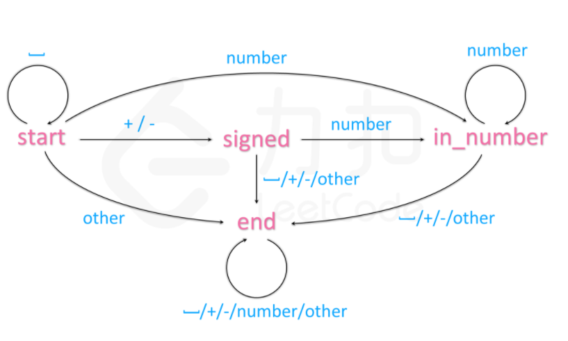
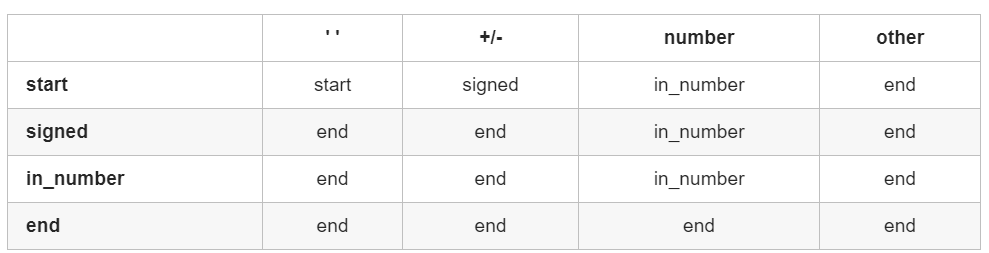

# LeetCode8：字符串转整数(atoi)

## 题目

请你来实现一个 atoi 函数，使其能将字符串转换成整数。

首先，该函数会根据需要丢弃无用的开头空格字符，直到寻找到第一个非空格的字符为止。接下来的转化规则如下：

如果第一个非空字符为正或者负号时，则将该符号与之后面尽可能多的连续数字字符组合起来，形成一个有符号整数。
假如第一个非空字符是数字，则直接将其与之后连续的数字字符组合起来，形成一个整数。
该字符串在有效的整数部分之后也可能会存在多余的字符，那么这些字符可以被忽略，它们对函数不应该造成影响。
注意：假如该字符串中的第一个非空格字符不是一个有效整数字符、字符串为空或字符串仅包含空白字符时，则你的函数不需要进行转换，即无法进行有效转换。

在任何情况下，若函数不能进行有效的转换时，请返回 0 。

提示：

> 本题中的空白字符只包括空格字符 ' ' 。
> 假设我们的环境只能存储 32 位大小的有符号整数，那么其数值范围为 [−231,  231 − 1]。如果数值超过这个范围，请返回  INT_MAX (231 − 1) 或 INT_MIN (−231) 。


示例 1:

> 输入: "42"
> 输出: 42

示例 2:

> 输入: "   -42"
> 输出: -42
> 解释: 第一个非空白字符为 '-', 它是一个负号。
>      我们尽可能将负号与后面所有连续出现的数字组合起来，最后得到 -42 。

示例 3:

> 输入: "4193 with words"
> 输出: 4193
> 解释: 转换截止于数字 '3' ，因为它的下一个字符不为数字。

示例 4:

> 输入: "words and 987"
> 输出: 0
> 解释: 第一个非空字符是 'w', 但它不是数字或正、负号。
>      因此无法执行有效的转换。

示例 5:

> 输入: "-91283472332"
> 输出: -2147483648
> 解释: 数字 "-91283472332" 超过 32 位有符号整数范围。 
>      因此返回 INT_MIN (−231) 。

来源：力扣（LeetCode）
链接：https://leetcode-cn.com/problems/string-to-integer-atoi
著作权归领扣网络所有。商业转载请联系官方授权，非商业转载请注明出处。

## 解法一

利用模拟的思想，将规则直接进行代码实现：

```cpp
class Solution {
public:
    int myAtoi(string str) {
        bool flag=true;		// 设置标志位 判断出现的' '/+/- 是否为"合理"状态
        int res=0, sign=1;  // 存放结果以及符号位
        for(char i:str){  // 遍历
            if(i==' '){		// 如果为空格 
                if(!flag) break; 
            }
            else if(i=='-' || i=='+'){	// 如果为+/-
                if(!flag) break;
                sign=(i=='-'?-1:1); 
                flag=false;   // 标志位置为false
            }
            else if(isdigit(i)){ // 如果为数字
                int x=i-'0';
                flag=false;  // 标志位置为false
                if(sign==1){  // sign为正
                    if(res > INT_MAX/10 || (res == INT_MAX/10 && x > INT_MAX%10)) return INT_MAX;
                    else res = res*10 + x;
                } 
                if(sign==-1){  // sign为负
                    if(res < INT_MIN/10 || (res==INT_MIN/10 && (x*sign) < INT_MIN%10)) return INT_MIN;
                    else res = res*10 + sign*x;
                }
            }
            else break; // 其他字符直接结束
        }
        return res;
    }
};
```

时间复杂度：O(n)

空间复杂度：O(1)

## 解法二

解法二比较有意思，使用自动机来进行，如下图所示，箭头表示状态的转移。



当然上面的箭头也可以变为一张表：



我们需要做的就是将这张表转换为代码

```cpp
class Solution {
public:
    
    string state="start";
    unordered_map<string, vector<string>> StateTable = {
        // 状态      空格      +/-    数字      其他
        {"start", {"start", "signed", "number", "end"}},
        {"signed", {"end", "end", "number", "end"}},
        {"number", {"end", "end", "number", "end"}}
    };

    int get_state(char c){  // 根据字符c判断当前的状态
        if(c==' ')  return 0;
        if(c=='+' || c=='-') return 1;
        if(isdigit(c)) return 2;
        else return 3;
    }

    int myAtoi(string str) {
        int res=0, sign=1;
        for(char c:str){
            state = StateTable[state][get_state(c)]; 	// 得到目前的状态
            if(state=="signed") sign=(c=='-'?-1:1);
            if(state=="number"){
                int x=c-'0';
                if(sign==1 && (res>INT_MAX/10 || (res==INT_MAX/10 && x>INT_MAX%10))) return INT_MAX;
                if(sign==-1 && (res<INT_MIN/10 || (res==INT_MIN/10 && (-1*x)<INT_MIN%10))) return INT_MIN;
                res = res*10 + sign*x;
            }
            if(state=="end") break;
        }
        return res;
    }
};
```

时间复杂度：O(n)

空间复杂度：O(1)，哈希表构建的状态转换是有限的